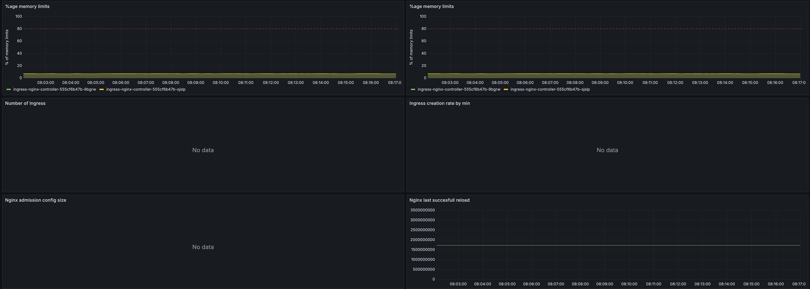
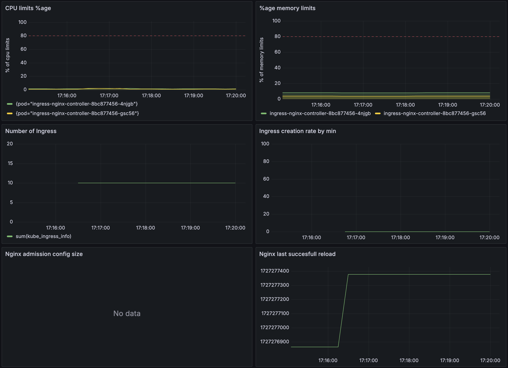
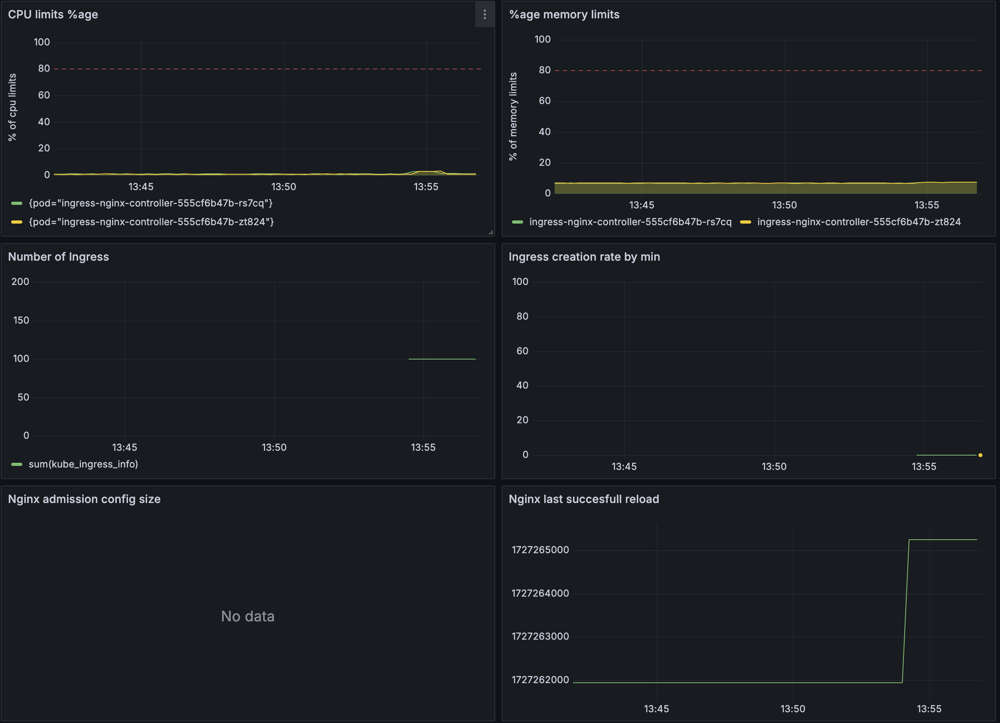
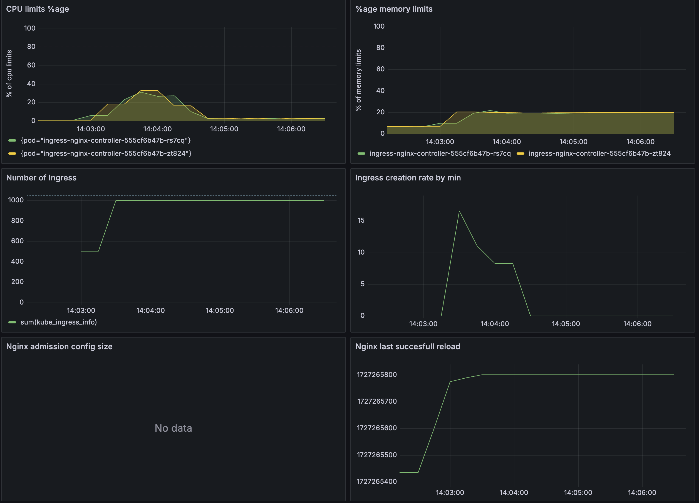
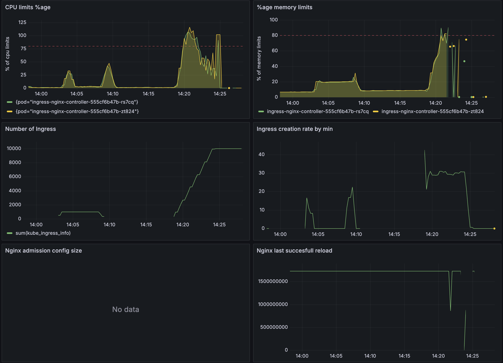
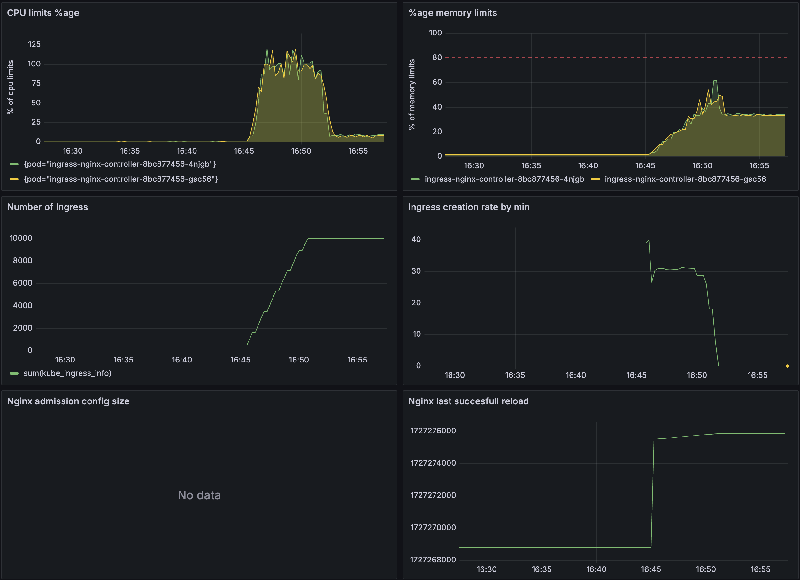

# ingress-nginx

## protocol

See [details](../../docs/PROTOCOL.md)

## configuration

Check [values](../../values/ingress-nginx.yaml)

## basic cumsumption

## no TLS / 10

- time: 1 sec
- rate: 10 ingress/sec

## no TLS / 100

- time: 4 sec
- rate: 25 ingress/sec

## no TLS / 1000

- time: 31 sec
- rate: 32,26 ingress/sec

## no TLS / 10000 (try #1)

- time: 304 sec
- rate: 32,89 ingress/sec

## no TLS / 10000 (try #2)

action: raised memory requests & limits form 1024Mi to 4096Mi 

- time: 337 sec
- rate: 29,67 ingress/sec

