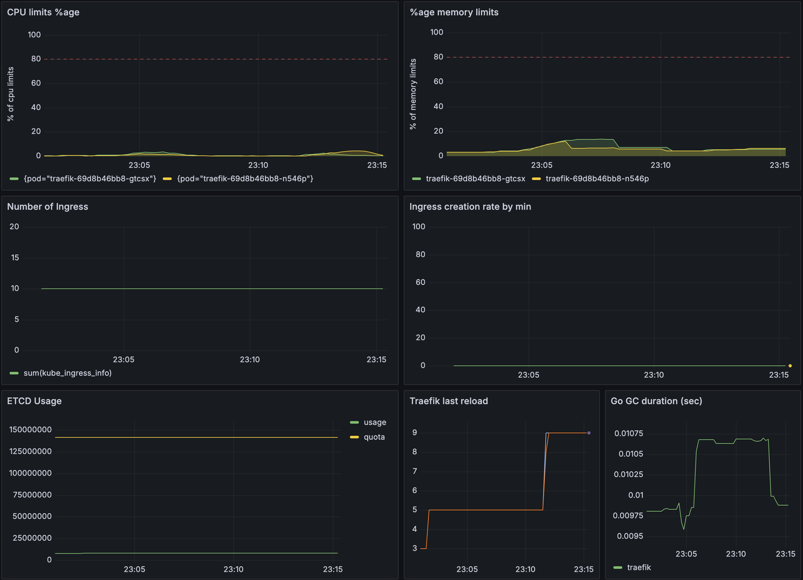
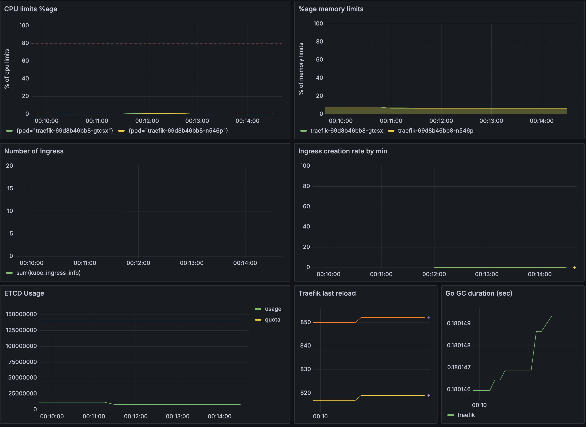
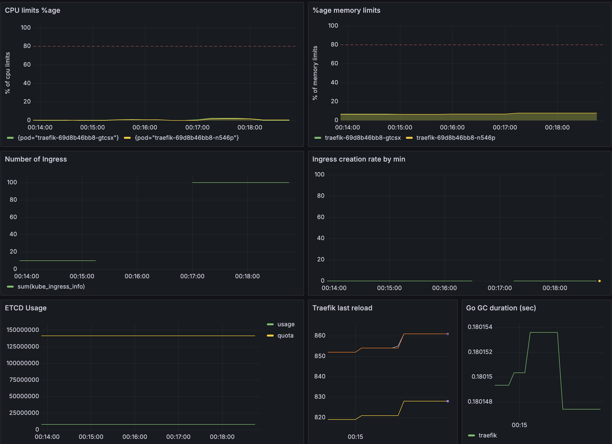
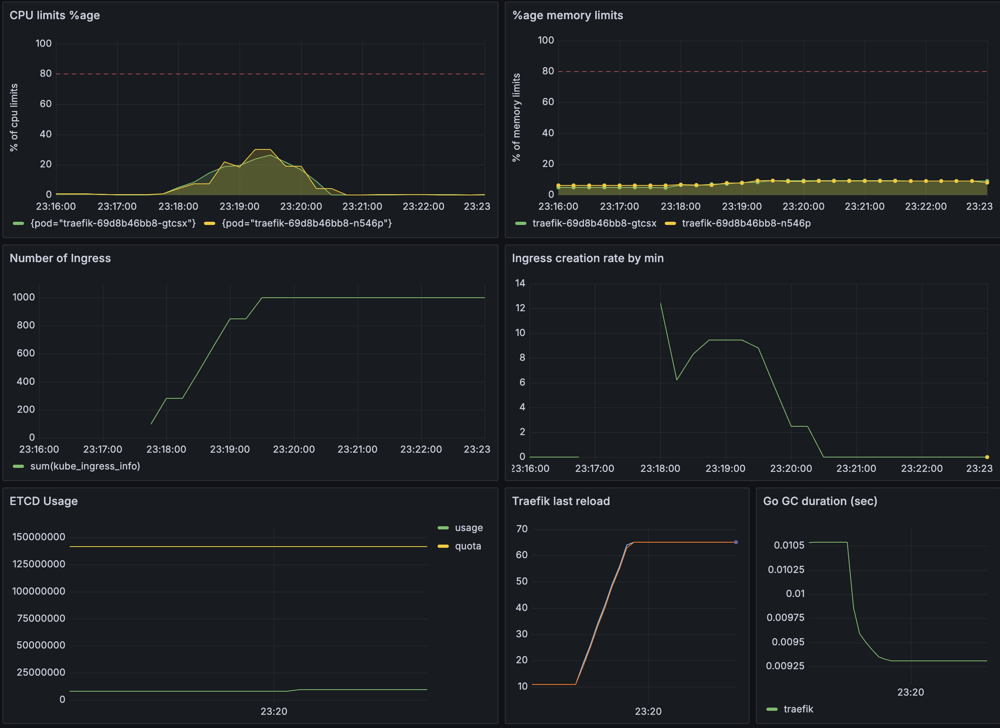
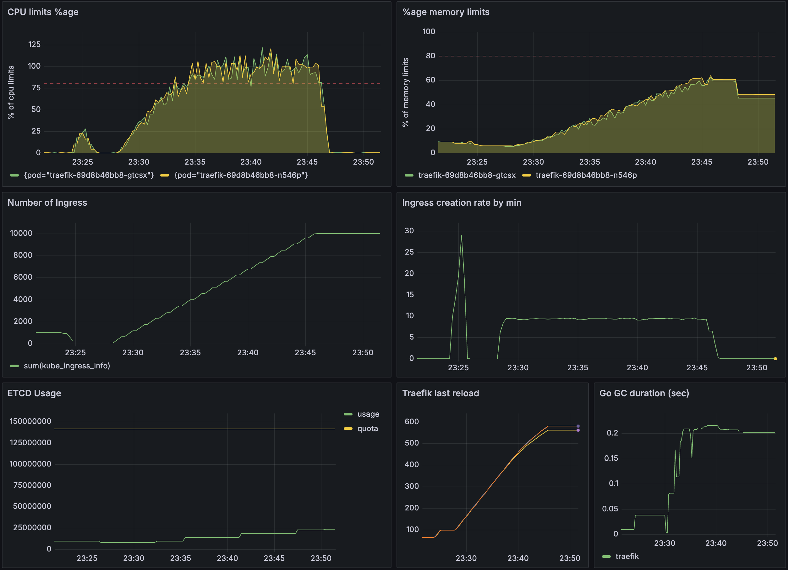

# traefik

## protocol

See [details](../../docs/PROTOCOL.md)

## configuration

Check [values](../../values/traefik.yaml)

## basic cumsumption

## no TLS / 10

- time: 1 sec
- rate: 10 ingress/sec

## no TLS / 100

- time: 12 sec
- rate: 8,33 ingress/sec

## no TLS / 1000

- time: 106 sec
- rate: 9,43 ingress/sec

## no TLS / 10000

- time: 1068 sec
- rate: 9,36 ingress/sec

