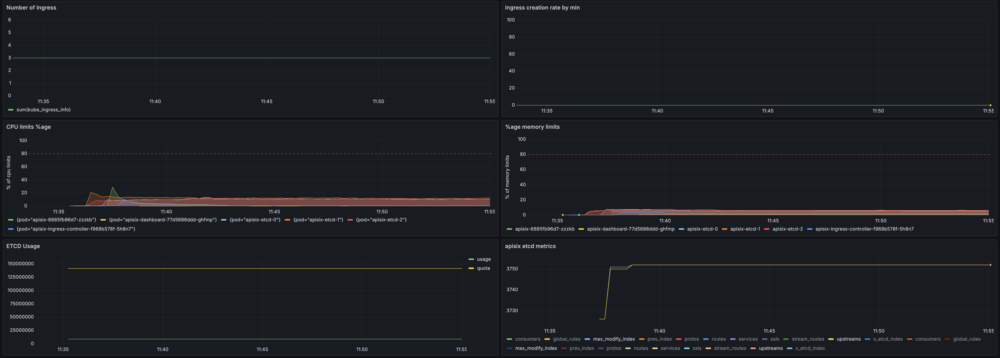
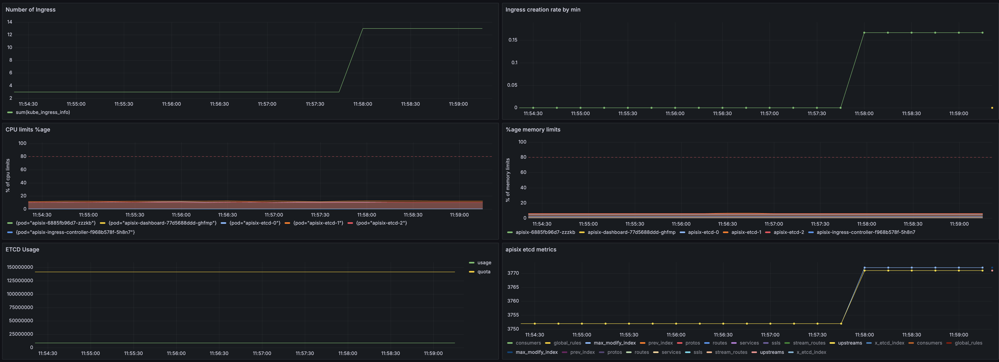
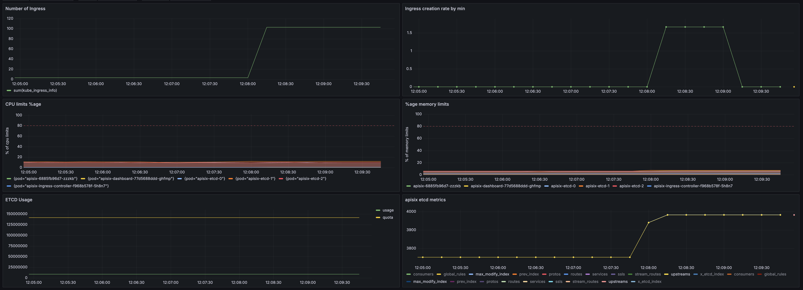
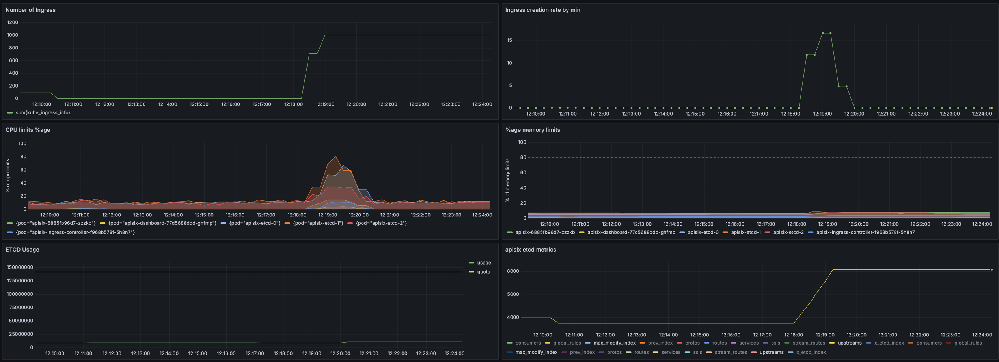
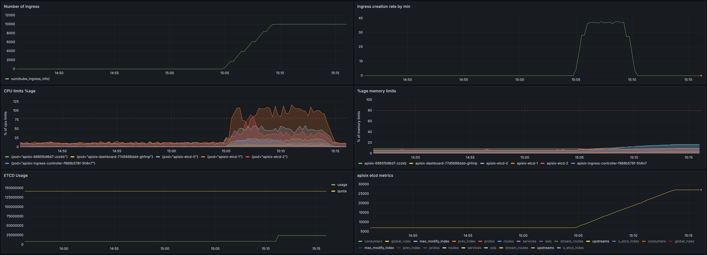
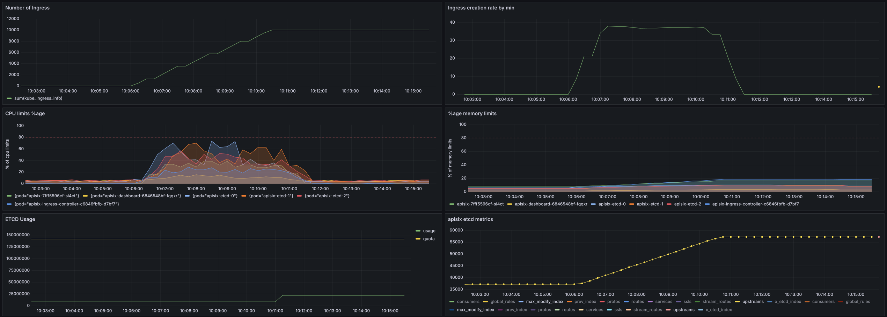
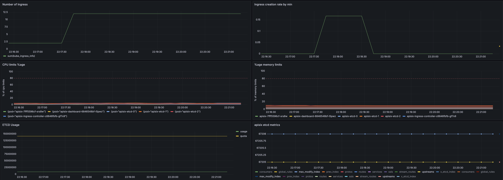
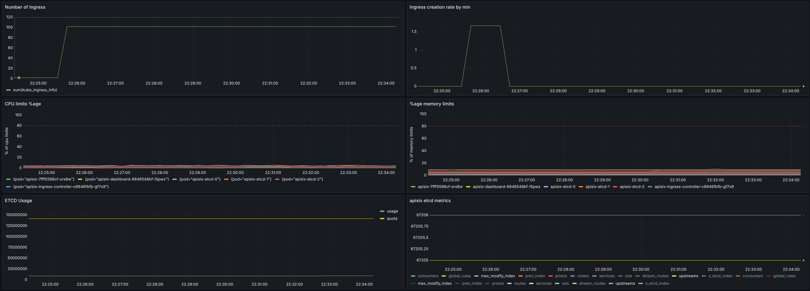
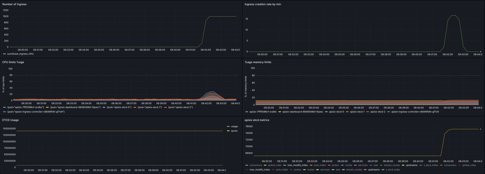
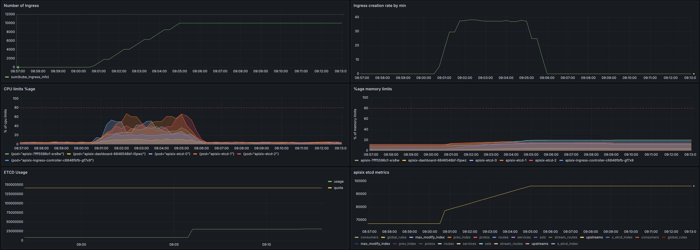

# apisix

## protocol

See [details](../../docs/PROTOCOL.md)

## configuration

Check [values](../../values/apisix.yaml)

## basic consumption

## without TLS or annotations

### noTLS / 10

- time: 7 sec
- rate: 1,43 ingress/sec

### noTLS / 100

- time: 3 sec
- rate: 33,33 ingress/sec

### noTLS / 1000

- time: 27 sec
- rate: 37,04 ingress/sec

### noTLS / 10000 (try 1)

- time: 277 sec
- rate: 36,10 ingress/sec

==> increase etcd CPU requests and limits

### noTLS / 10000 (try 2)

- time: 264 sec
- rate: 37,8 ingress/sec

## with annotations (and no TLS)

### annotations / 10

- time: 2 sec
- rate: 5 ingress/sec

### annotations / 100

- time: 3 sec
- rate: 33,33 ingress/sec

### annotations / 1000

- time: 28 sec
- rate: 35,71 ingress/sec

### annotations / 10000

- time: 269 sec
- rate: 37,17 ingress/sec

