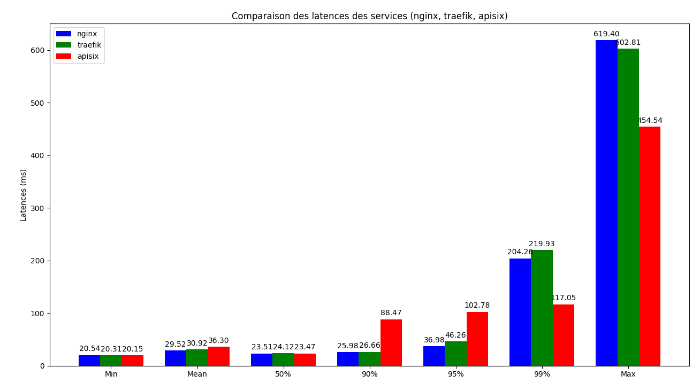

# performances

## protocol

```shell
vegeta attack --targets targets.txt --duration=120s > results.bin
vegeta report < results.bin
```

## nginx

```none
Requests      [total, rate, throughput]         6000, 50.01, 50.00
Duration      [total, attack, wait]             2m0s, 2m0s, 24.491ms
Latencies     [min, mean, 50, 90, 95, 99, max]  20.539ms, 29.525ms, 23.508ms, 25.977ms, 36.975ms, 204.26ms, 619.402ms
Bytes In      [total, mean]                     9998970, 1666.49
Bytes Out     [total, mean]                     0, 0.00
Success       [ratio]                           100.00%
Status Codes  [code:count]                      200:6000
```

## traefik

```none
Requests      [total, rate, throughput]         6000, 50.01, 50.00
Duration      [total, attack, wait]             2m0s, 2m0s, 22.323ms
Latencies     [min, mean, 50, 90, 95, 99, max]  20.306ms, 30.923ms, 24.124ms, 26.658ms, 46.257ms, 219.932ms, 602.808ms
Bytes In      [total, mean]                     9845842, 1640.97
Bytes Out     [total, mean]                     0, 0.00
Success       [ratio]                           100.00%
Status Codes  [code:count]                      200:6000
Error Set:
```

## apisix

```none
Requests      [total, rate, throughput]         6000, 50.01, 50.00
Duration      [total, attack, wait]             2m0s, 2m0s, 24.001ms
Latencies     [min, mean, 50, 90, 95, 99, max]  20.15ms, 36.298ms, 23.469ms, 88.469ms, 102.779ms, 117.046ms, 454.544ms
Bytes In      [total, mean]                     9552780, 1592.13
Bytes Out     [total, mean]                     0, 0.00
Success       [ratio]                           100.00%
Status Codes  [code:count]                      200:6000
Error Set:
```

## graph


